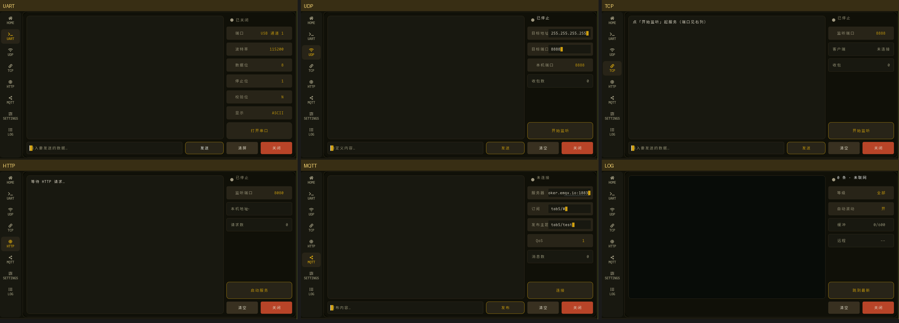

# Nova Toolbox · M5Stack Tab5 调试工具箱

把 [M5Stack Tab5](https://docs.m5stack.com/en/products/sku/k145)（ESP32-P4 + ESP32-C6）做成一台**随身硬件/网络调试终端**。

原厂固件（M5Tab5-UserDemo）的 Launcher 是一堆演示面板；这个项目把它换成一套**实际调试时真用得上**的工具集：串口、UDP、TCP、HTTP、MQTT、设备日志，配统一的界面骨架和 OTA 升级。

> 个人自用项目，仍在迭代。代码结构尽量保持清晰，欢迎 fork 改成自己的调试台。



---

## 功能

| 工具 | 说明 |
|---|---|
| **HOME** | 全屏卡片式主页，点卡片直接进工具 |
| **串口** | 板载 RS-485 + **外接 USB 转串口**双后端；打开/关闭、收发、ASCII/HEX 显示切换、波特率/数据位/停止位/校验位 |
| **UDP** | ⚠️ **待完善** — 开始/停止监听（真建 socket）、收发、支持广播、目标地址与端口可改 |
| **TCP** | ⚠️ **待完善** — 服务端模式：开始/停止监听、接受 1 个客户端、收发（自由输入，不是写死的演示载荷） |
| **HTTP** | ⚠️ **待完善** — 起一个 httpd，记录进来的请求（方法 / URI / query / 关键头 / 请求体） |
| **MQTT** | ⚠️ **待完善** — 客户端：服务器 / 订阅主题 / **发布主题** / QoS 都可改，发布自由输入 |
| **LOG** | 设备端日志：按等级着色（E 红 / W 黄 / I 奶白）、等级过滤、自动滚动开关、跳到最新；联网时 PC 可远程拉取 |
| **SETTINGS** | WiFi（纯 STA，设备端输入 SSID/密码）、OTA 检查与升级、系统信息 |

### 外接 USB 转串口（本项目的重点）

Tab5 的 USB Type-A 是主机口，固件开机即启动 USB 主机栈，可以直接插 USB↔485/232 适配器当串口用 —— 板载 RS-485 留给"手边没转换器"的应急场景。

串口工具的「端口」行循环切换：`RS485` → `USB 通道 1~4`（通道号对应多串口芯片的 USB 接口 0/2/4/6）。

已支持芯片：

| 芯片 | 驱动路径 |
|---|---|
| CH340 / CH341 | `usb_host_ch34x_vcp`（WCH vendor 协议） |
| CH342 / CH343 / **CH344** / CH9102 / CH347 | 标准 **CDC-ACM**（`usb_host_cdc_acm`） |
| CP2102 / CP2104 | `usb_host_cp210x_vcp` |
| FT232 | `usb_host_ftdi_vcp` |

> 踩坑记录：CH344 这类多路 CDC 芯片的**配置描述符超过 256 字节**，而 ESP-IDF 的控制传输缓冲默认只有 256 →
> 枚举直接失败，现象是"插着但找不到设备"。必须把 `CONFIG_USB_HOST_CONTROL_TRANSFER_MAX_SIZE` 调大（本项目用 1024）。

---

## 硬件与环境

- **主控**：M5Stack Tab5（ESP32-P4NRW32，16MB Flash / 32MB PSRAM）+ ESP32-C6-MINI（Wi-Fi 6，SDIO）
- **屏幕**：5" IPS 1280×720（MIPI-DSI，ST712x 触摸）
- **外设**：USB Type-A(Host) / USB Type-C(OTG)、RS-485（SIT3088 + 可切换 120Ω 终端电阻）、ES8388 音频、ES7210 双麦、microSD、BMI270
- **框架**：ESP-IDF **v5.5.4** + LVGL **9.2.2** + smooth_ui_toolkit

### 编译（真机）

```bash
# 1) 准备 ESP-IDF v5.5.4 环境
source $IDF_PATH/export.sh

# 2) 编译（组件依赖由 IDF Component Manager 自动拉取，需要联网）
cd platforms/tab5
idf.py build

# 3) 烧录
idf.py -p /dev/ttyACM0 flash
```

> 注意：`platforms/tab5/sdkconfig.defaults` 里已包含本项目必需的开关
> （`CONFIG_ESP32P4_SELECTS_REV_LESS_V3`、`CONFIG_I2C_SKIP_LEGACY_CONFLICT_CHECK`、
> `CONFIG_COMPILER_CXX_EXCEPTIONS`（USB VCP 芯片驱动要求）、
> `CONFIG_USB_HOST_CONTROL_TRANSFER_MAX_SIZE=1024`、`CONFIG_ESP_HTTPS_OTA_ALLOW_HTTP` 等）。
> 如果重新生成 sdkconfig，请确认这些值没被覆盖。

### 桌面模拟器（PC 上预览 UI，不用烧板）

给桌面端打了一套 ESP-IDF 头文件桩（`platforms/desktop/compat/`），同一份 UI 源码在 PC 上
用 **LVGL 原生 X11 后端**渲染，开发时改完即可截图确认。

```bash
mkdir -p build && cd build
cmake ..
make -j8
# 页码：0=HOME 1=串口 2=UDP 3=TCP 4=HTTP 5=MQTT 6=SETTINGS 7=LOG
./desktop/app_desktop_build 8 /tmp/out.ppm 1
```

> 桌面端只有 UI，没有真实网络/串口/USB 行为；硬件相关一律以真机为准。

### OTA

设备通过 HTTP 从自建服务拉固件（`platforms/tab5/components/ota_client/`），分区表是双 OTA（`ota_0` / `ota_1`），
升级后自动切换启动分区。服务端地址在 `sdkconfig` 的 `CONFIG_OTA_URL`。

---

## 代码结构

```
app/apps/app_launcher/view/
├── toolbox_home.{h,cpp}      顶栏 / 底栏 / 左侧导航 / 主页卡片
├── toolbox_theme.h           设计系统 token（颜色 / 间距 / 圆角 / 字体 / 触摸规范）
├── toolbox_layout.h          工具页两列骨架（所有工具页共用，保证同构）
├── tool_serial.cpp           串口（RS-485 + USB 双后端）
├── tool_udp/tcp/http/mqtt.cpp 四个网络工具
├── tool_log.{h,cpp}          设备端日志页
├── tool_logsys.{h,cpp}       日志环形缓冲 + HTTP 远程拉取
├── tool_settings.{h,cpp}     WiFi / OTA / 系统信息
└── fonts/                    点阵字体（IBM Plex Mono + 中文字形）
platforms/tab5/               ESP32-P4 平台层（HAL、分区表、OTA、USB 串口组件）
platforms/desktop/            PC 预览平台（X11 后端 + IDF 头文件桩）
```

### 设计系统

界面遵循一套 token 化的设计系统（`toolbox_theme.h`）：颜色语义化、尺寸走 4pt 网格、
间距只用 4/8/16/24/32 阶梯、触摸目标按 294PPI 取 96px（≈8.3mm）。
所有工具页共用同一套两列骨架（`toolbox_layout.h`）：左列操作区 + 右列状态/配置/主操作，
保证"几页放一起像同一套产品"。

---

## 参考与致谢

本项目站在不少开源工作的肩上，逐项列明来源：

### 直接依赖 / 二次开发基础

| 项目 | 用途 | 许可 |
|---|---|---|
| [m5stack/M5Tab5-UserDemo](https://github.com/m5stack/M5Tab5-UserDemo) | **项目基础**：应用框架、启动动画、HAL 抽象、上游工具面板与字体（桌面端已由本项目改为 X11 后端 + IDF 头文件桩） | MIT |
| [espressif/esp-bsp](https://github.com/espressif/esp-bsp)（`m5stack_tab5`） | 板级支持：屏幕/触摸/音频/IO 扩展器/USB 主机初始化 | Apache-2.0 |
| [espressif/esp-idf](https://github.com/espressif/esp-idf) | 构建系统与驱动（本项目用 v5.5.4） | Apache-2.0 |
| [lvgl/lvgl](https://github.com/lvgl/lvgl) | GUI 库（9.2.2） | MIT |
| [Forairaaaaa/smooth_ui_toolkit](https://github.com/Forairaaaaa/smooth_ui_toolkit) | 上层 UI 封装（上游项目使用） | MIT |
| [Forairaaaaa/mooncake](https://github.com/Forairaaaaa/mooncake) | 应用框架（AppAbility / Window） | MIT |
| 其它组件依赖 | 见 `platforms/tab5/main/idf_component.yml`（esp_hosted、esp_wifi_remote、esp_lcd_*、led_strip、esp-audio-player 等） | Apache-2.0 等 |

### 外接 USB 转串口

| 项目 | 用途 |
|---|---|
| [espressif/esp-usb](https://github.com/espressif/esp-usb) | `usb_host_vcp` / `usb_host_cdc_acm` / `usb_host_ch34x_vcp` / `usb_host_cp210x_vcp` / `usb_host_ftdi_vcp` —— 全部 USB 串口驱动都来自这里 |
| [WCH 官方 ch343ser_linux](https://github.com/WCHSoftGroup/ch343ser_linux) | **事实依据**：CH343/CH344/CH9102/CH347 的 USB PID 表与"完全兼容 CDC-ACM 标准"的说明 |

### 设计参考

| 项目 | 用途 |
|---|---|
| [0day1day/Slave_I](https://github.com/0day1day/Slave_I) | **设计系统思路参考**：Field Armor 配色、token 化的设计系统组织方式、双芯片（P4 UI + C6 无线电）RPC 分工与桌面模拟器做法 |
| [M5Stack Tab5 官方文档](https://docs.m5stack.com/en/products/sku/k145) | 引脚定义、外设说明 |
| [M5Stack 社区论坛](https://community.m5stack.com/topic/7702/tab5-power-up-sequence) | USB-A 口供电（IO 扩展器 `USB5V_EN`）等硬件细节 |

### 工具与素材

| 项目 | 用途 | 许可 |
|---|---|---|
| [lv_font_conv](https://github.com/lvgl/lv_font_conv) | 生成 LVGL 点阵字体 | MIT |
| [IBM Plex Mono](https://github.com/IBM/plex) | 拉丁字形（`ibm_plex_mono_*.c`，随上游项目提供） | SIL OFL 1.1 |
| [Font Awesome 5](https://fontawesome.com/) | 导航栏图标字形 | SIL OFL 1.1（字体）/ CC BY 4.0（图标） |
| [Maple Mono NF CN](https://github.com/subframe7536/maple-font) | 中文字形（`tb_cn_16.c` 由该字体用 lv_font_conv 生成） | SIL OFL 1.1 |

完整的第三方许可证原文见 [`THIRD_PARTY_NOTICES.md`](THIRD_PARTY_NOTICES.md)。

---

## 许可证

本项目在 [M5Tab5-UserDemo](https://github.com/m5stack/M5Tab5-UserDemo)（MIT，Copyright © 2025 M5Stack Technology CO LTD）基础上二次开发，
沿用 **MIT** 许可，原始版权声明保留在 [`LICENSE`](LICENSE) 中。新增代码同样以 MIT 发布。

## 开发状态

串口工具经过完整调试（板载 RS-485 与外接 USB 转串口都实测通过）；
**UDP / TCP / HTTP / MQTT 四个网络工具目前是「能用但不够完善」的状态** ——
骨架、真实启停、收发链路都通了，但调试时真正需要的不少能力还没做，列在这里免得误用：

| 工具 | 状态 | 缺什么 |
|---|---|---|
| 串口 | ✅ 可用 | — |
| LOG / SETTINGS | ✅ 可用 | — |
| UDP | ⚠️ 待完善 | 无 HEX 收发/显示、无报文历史落盘、无定时/循环发送、无收发包统计 |
| TCP | ⚠️ 待完善 | **只有服务端**，无客户端模式；只接受 1 个客户端；无 HEX；无断线自动重连 |
| HTTP | ⚠️ 待完善 | **只有服务端**，无「发请求」的客户端模式；不能自定义响应内容；请求体只读前 256 字节 |
| MQTT | ⚠️ 待完善 | 无 TLS、无用户名/密码认证、只支持单个订阅主题、消息不落盘、无 retained/LWT 设置 |

通用缺口：网络类工具都还没有 HEX 视图（串口已有）、没有收发时间戳、没有历史记录导出。

### 其它已知限制

- 桌面模拟器只有 UI，没有真实网络/串口/USB 行为（硬件相关一律以真机为准）
- 外接 USB 转串口固定打开接口 0/2/4/6 对应的 1~4 通道，未支持更多通道

---

## 路线图（感兴趣的可以自己接着做）

1. UDP/TCP 的 HEX 收发与显示（对齐串口工具的做法）
2. TCP 客户端模式 + 多客户端支持
3. HTTP 客户端模式（构造并发出请求，看响应）
4. MQTT TLS / 认证 / 多主题订阅
5. 网络工具的报文落盘与导出（SD 卡）
